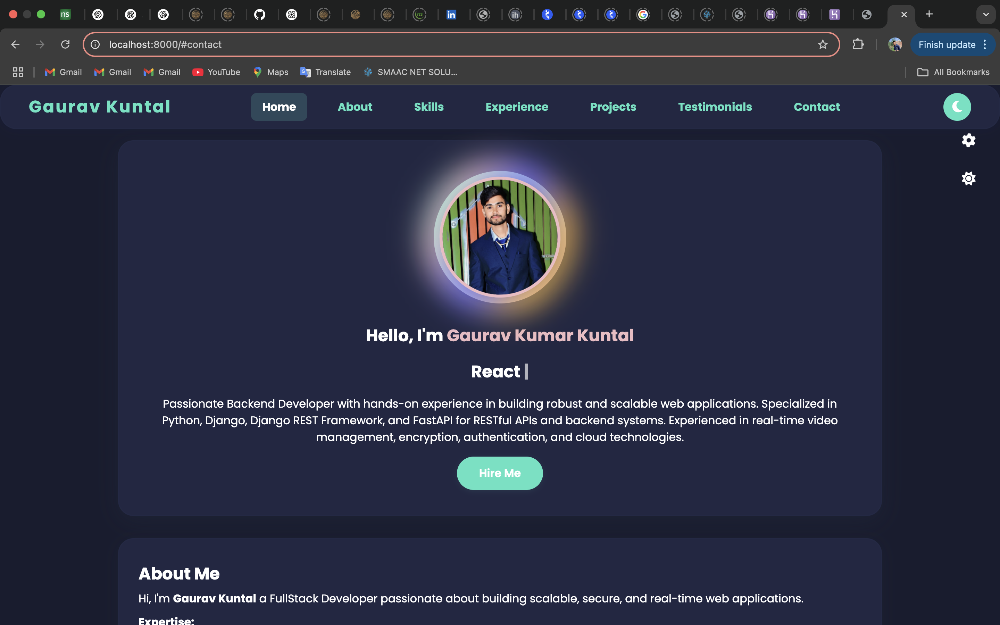
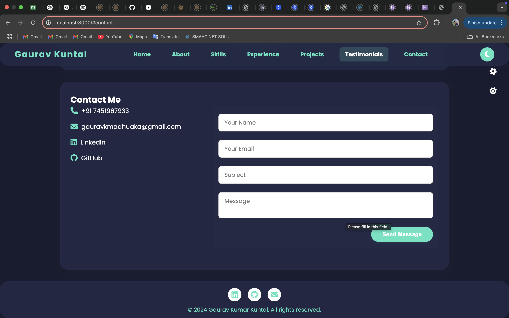
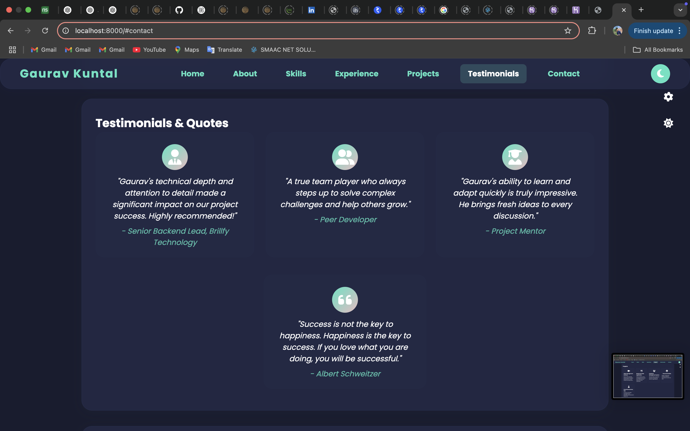
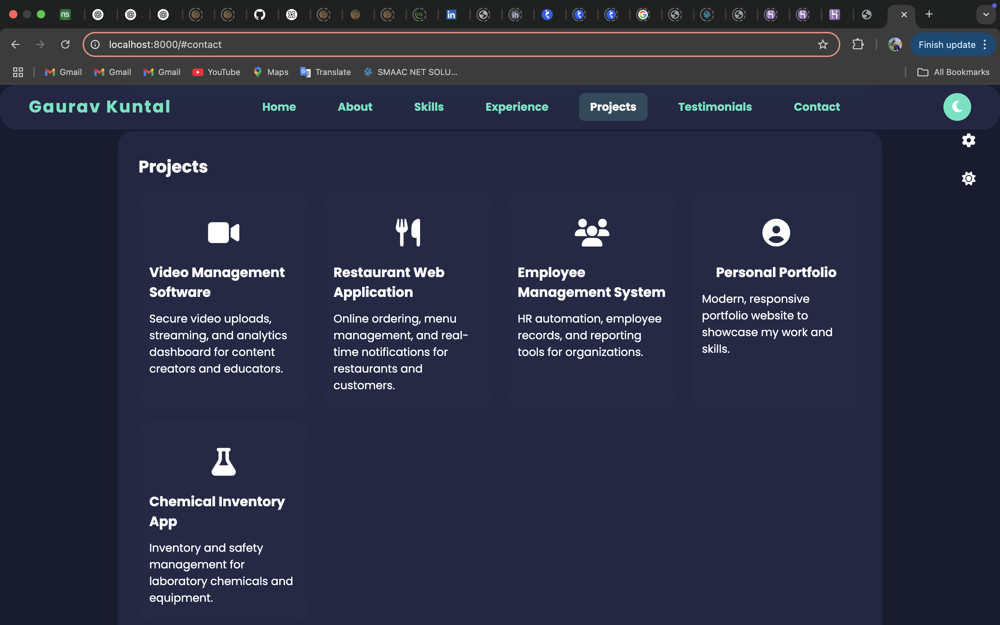
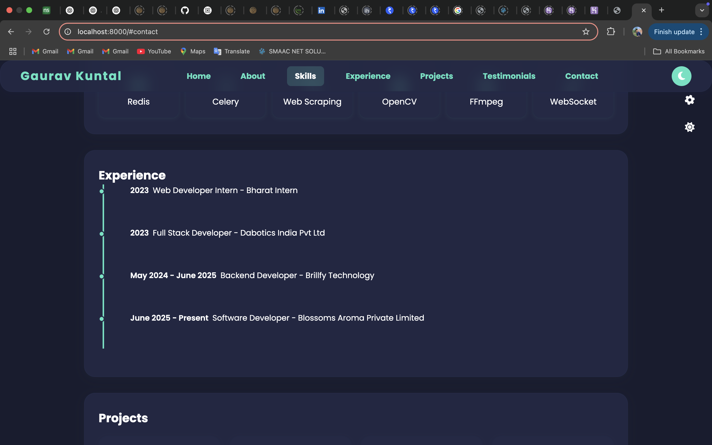
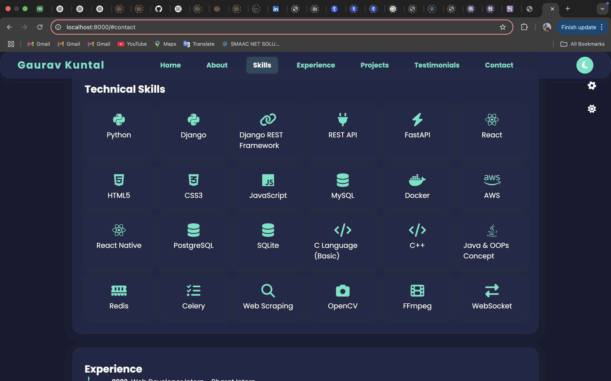
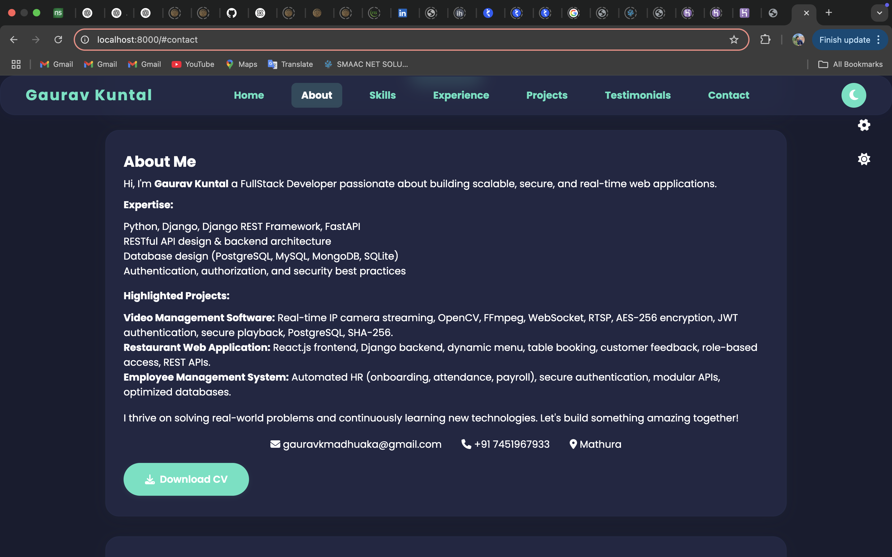

# My-portfolio

A modern, responsive, and professional portfolio website to showcase my work, skills, and experience.

---

## 🚀 Overview
This portfolio highlights my expertise as a Full Stack/Backend Developer, featuring:
- Animated hero section with unique profile frame
- Skills, experience, and project showcase
- Testimonials, contact form, and downloadable CV
- Fully responsive, dark/light mode, and theme color switcher

---

## ✨ Features
- **Modern UI/UX:** Glassmorphism, animated profile frame, and smooth transitions
- **Responsive Design:** Looks great on all devices
- **Theme Support:** Dark/light mode and accent color switcher
- **Downloadable Resume:** Easy access to my CV
- **Contact Form:** For direct communication

---

## 🛠️ Tech Stack
- HTML5, CSS3 (with custom animations)
- JavaScript (vanilla, no frameworks)
- [Font Awesome](https://fontawesome.com/) for icons
- [Google Fonts](https://fonts.google.com/)

---

## 📸 Screenshots

### Hero & Profile Section


### Contact Section


### Testimonials Section


### Experience Section


### Projects Section


### Skills Section


### About Section


### Download CV Button


---

## 📝 Setup & Usage
1. Clone this repo:
   ```bash
   git clone https://github.com/kuntalgaurav2001/My-portfolio.git
   ```
2. Open `index.html` in your browser (no build step needed)
3. For best experience, use a local server (e.g. VSCode Live Server)

---

## 📄 License
MIT

---

**Made with passion by Gaurav Kuntal**